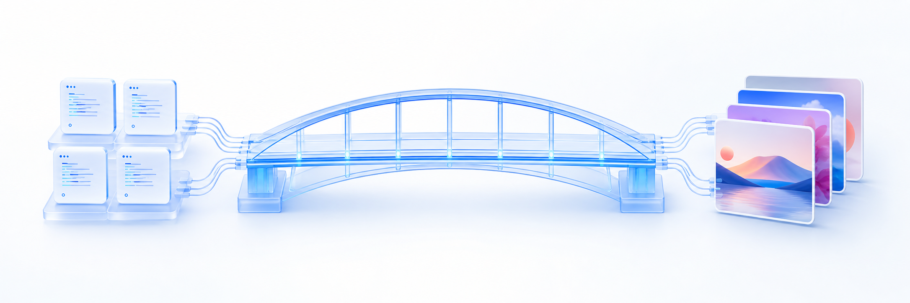
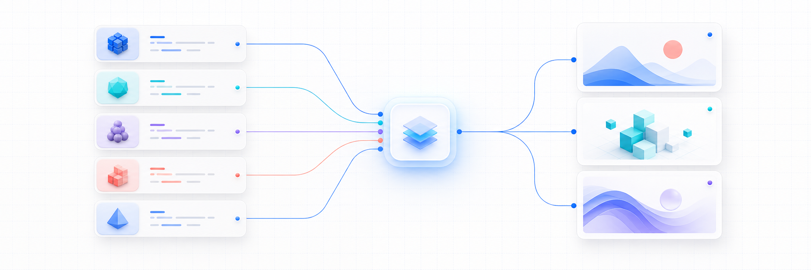

<p align="center">
  
</p>

<h1 align="center">GPTLink</h1>

<p align="center">
  <strong>Give every coding agent one clean interface for GPT Image generation.</strong><br>
  Self-hosted · OpenAI-compatible · MCP-native · powered by your authenticated Codex session
</p>

<p align="center">
  <a href="https://github.com/sanmaxdev/gptlink/actions"></a>
  
  
  
  <a href="LICENSE"></a>
</p>

<p align="center">
  <a href="#one-command-agent-setup">Quick start</a> ·
  <a href="#supported-agents">Agents</a> ·
  <a href="#remote-vps-mode">VPS</a> ·
  <a href="#api-compatibility">API</a> ·
  <a href="docs/AGENTS.md">Agent guide</a>
</p>

GPTLink turns an authenticated ChatGPT/Codex session into a private image
gateway for software agents and applications. It supports text-to-image,
reference editing, masks, variations, arbitrary supported aspect ratios, and
high-resolution output without requiring an OpenAI Platform API key for the
image-generation path.

> [!IMPORTANT]
> GPTLink is an experimental, unofficial bridge. It is not an OpenAI product
> and does not convert a ChatGPT subscription into an official OpenAI Platform
> API entitlement. Use it only with an account you control, keep it private,
> and follow applicable terms and usage limits.

## Why GPTLink

| One gateway | Full image workflow | Agent-native | Private by default |
|---|---|---|---|
| OpenAI-style `/v1` API and MCP from the same service | Generate, edit, combine, mask, vary, resize, stream | Claude Code, Antigravity, Codex, Hermes, and generic MCP | Loopback binding, hashed keys, isolated management routes |

## One-command agent setup

### Let your agent install it

Paste this instruction into Claude Code, Antigravity, Codex, or another coding
agent with terminal access:

```text
Install GPTLink from https://github.com/sanmaxdev/gptlink for this user.
Use local MCP mode, reuse my existing Codex authentication if available,
install the GPTLink image skill for your agent, verify gptlink_status, and tell
me only if I need to complete device login. Follow the repository README and
docs/AGENTS.md. Never print or copy OAuth tokens.
```

The deterministic setup underneath that instruction is:

```bash
git clone https://github.com/sanmaxdev/gptlink.git
cd gptlink
python3 scripts/bootstrap-agent.py --agent all --scope user --mode local
```

On Windows, use `py` instead of `python3`:

```powershell
git clone https://github.com/sanmaxdev/gptlink.git
Set-Location gptlink
py scripts\bootstrap-agent.py --agent all --scope user --mode local
```

The bootstrapper creates `.venv`, installs the declared dependencies, merges
the agent's MCP configuration, installs the `gptlink-images` skill, and leaves
existing unrelated configuration untouched.

Prerequisites:

- Python 3.11 or newer (`python3-venv` on Ubuntu)
- Git
- Codex CLI with an existing login, or the ability to complete device login
- At least one supported agent CLI when using automatic registration

After restarting the agent, try:

```text
Use GPTLink to create a high-quality 16:9 cinematic image of Colombo during a
futuristic rainy night. Save the PNG in this project's assets directory.
```

## Supported agents

| Agent | Local setup | Remote setup | Installed integration |
|---|---|---|---|
| Claude Code | `--agent claude-code --mode local` | `--agent claude-code --mode remote` | MCP config + Claude skill |
| Antigravity | `--agent antigravity --mode local` | `--agent antigravity --mode remote` | MCP config + Antigravity plugin/skill |
| Codex | `--agent codex --mode local` | `--agent codex --mode remote` | `codex mcp` config + Codex skill |
| Hermes Agent | `hermes plugins install sanmaxdev/gptlink --enable` | Same-VPS plugin recommended | Explicit plugin + scanner-safe skill |
| Cursor, Windsurf, OpenCode, Goose, others | Use `integrations/generic/stdio.json` | Use `integrations/generic/remote.json` | Standard MCP |

Install only the active agent:

```bash
python3 scripts/bootstrap-agent.py --agent claude-code --scope user --mode local
python3 scripts/bootstrap-agent.py --agent antigravity --scope user --mode local
python3 scripts/bootstrap-agent.py --agent codex --scope user --mode local
```

For project-only Claude Code or Antigravity configuration, run inside the
target project with `--scope project`. Codex registration currently uses user
scope.

### Hermes autonomous setup

```bash
hermes plugins install sanmaxdev/gptlink --enable
```

Then tell Hermes:

```text
/gptlink-image Set up GPTLink on this VPS, reuse my existing OpenAI-Codex login,
and give me the device link and code only if another login is required.
```

Hermes manages the clone, environment, authentication handoff, private server,
internal gateway key, and native image delivery. See [the Hermes guide](docs/HERMES.md).

## How it works

<p align="center">
  
</p>

```text
Claude Code ─┐
Antigravity ─┤
Codex ───────┼── MCP (stdio or HTTPS) ── GPTLink ── authenticated Codex session
Hermes ──────┤                              │
Other agents ┘                              └── saved images + history

Applications ── OpenAI-compatible /v1 API ─┘
```

The MCP layer returns compact paths and URLs instead of injecting large base64
images into the agent's context.

## Image capabilities

- Text-to-image generation
- Up to 16 reference images per edit
- Mask-guided editing
- Reference-based variations
- One to ten outputs per request
- `1:1`, `16:9`, `9:16`, `4:3`, or any supported custom aspect ratio
- Exact dimensions up to the model's supported limits
- PNG, JPEG, and WebP
- JPEG/WebP compression control
- Low, medium, high, and automatic quality
- Partial previews and Server-Sent Events
- Local file paths, HTTP(S) references, and data URLs through MCP
- Image history with saved paths and URLs

### MCP tools

| Tool | Purpose |
|---|---|
| `gptlink_status` | Check authentication and readiness |
| `gptlink_models` | Discover models and controls |
| `gptlink_generate` | Generate one or more images from text |
| `gptlink_edit` | Edit or combine up to 16 references, optionally with a mask |
| `gptlink_variation` | Produce alternatives that preserve source identity |
| `gptlink_history` | Retrieve recent outputs without base64 context bloat |

## Remote VPS mode

Use remote mode when GPTLink runs on a VPS and agents connect over HTTPS.

```bash
git clone https://github.com/sanmaxdev/gptlink.git
cd gptlink
sudo bash scripts/install-vps.sh
sudo -u gptlink -H codex login --device-auth
sudo systemctl start gptlink
```

Set the public origin in `/etc/gptlink.env`:

```bash
GPTLINK_PUBLIC_BASE_URL=https://images.example.com
```

Create a separate revocable key for each agent:

```bash
sudo -u gptlink -H /opt/gptlink/.venv/bin/python \
  /opt/gptlink/manage.py create-key Claude-Code
```

On the agent machine:

```bash
export GPTLINK_API_KEY='gptlink_generated_secret'
python3 scripts/bootstrap-agent.py \
  --agent claude-code \
  --scope user \
  --mode remote \
  --url https://images.example.com
```

Remote MCP is available at `https://images.example.com/mcp/`. Use HTTPS for
every non-loopback connection. Remote agents cannot pass client-local paths to
the VPS; use accessible HTTP(S) references or local stdio mode for those files.

See the complete [Ubuntu VPS guide](docs/VPS.md).

## Windows desktop

For the local dashboard, double-click `Launch-GPTLink.cmd`. The launcher creates
the environment when needed and opens `http://127.0.0.1:8787`.

To connect Windows agents afterward:

```powershell
.venv\Scripts\python.exe scripts\install-agent.py --agent all --scope user --mode local
```

## API compatibility

GPTLink implements the image portions of the OpenAI Images API plus a focused
Responses image-generation bridge.

| Endpoint | Description |
|---|---|
| `POST /v1/images/generations` | Text-to-image |
| `POST /v1/images/edits` | References and masks |
| `POST /v1/images/variations` | Reference-based variation emulation |
| `POST /v1/responses` | Image-generation tool requests |
| `GET /v1/models` | Supported aliases |
| `/mcp/` | Authenticated MCP Streamable HTTP |
| `GET /health` | Health check |

<details>
<summary><strong>OpenAI-style request example</strong></summary>

```bash
curl http://127.0.0.1:8787/v1/images/generations \
  -H "Authorization: Bearer $GPTLINK_API_KEY" \
  -H "Content-Type: application/json" \
  -d '{
    "prompt": "A luminous tropical city at golden hour",
    "model": "gpt-image-2-medium",
    "aspect_ratio": "16:9",
    "response_format": "url"
  }'
```

</details>

Supported aliases: `gpt-image-2-low`, `gpt-image-2-medium`,
`gpt-image-2-high`, and `gpt-image-2-auto`.

## Security model

- The service binds to `127.0.0.1` by default.
- Codex and Hermes OAuth tokens remain in their existing credential stores.
- GPTLink never stores OAuth tokens in its SQLite database.
- Gateway secrets are stored only as SHA-256 hashes.
- Remote MCP uses the same revocable per-agent Bearer keys as `/v1`.
- Local MCP file access is constrained to configured allowed roots.
- The supplied Caddy policy excludes the dashboard and `/api/*` management routes.
- Hermes executable logic is isolated in an explicitly enabled plugin; its
  bundled community skill remains scanner-safe and non-executable.

Never publish port `8787`, OAuth credential files, browser cookies, or a
GPTLink agent key.

## Documentation

| Guide | Use it for |
|---|---|
| [Agent installation](docs/AGENTS.md) | Claude Code, Antigravity, Codex, generic MCP, autonomous agent flow |
| [Hermes plugin](docs/HERMES.md) | Fully managed Hermes installation and authentication reuse |
| [Ubuntu VPS](docs/VPS.md) | systemd, Caddy, DNS, HTTPS, firewall, updates, backups |
| [Generic stdio template](integrations/generic/stdio.json) | Local MCP clients |
| [Generic remote template](integrations/generic/remote.json) | Hosted MCP clients |

## Development

```bash
python3 -m venv .venv
.venv/bin/pip install -r requirements.txt
.venv/bin/python -m pytest
.venv/bin/python run.py
```

Windows equivalents are provided by `Setup-GPTLink.ps1` and
`Launch-GPTLink.cmd`.

---

<p align="center">
  Built for agents that need images—not another pile of provider-specific glue.<br>
  <a href="LICENSE">MIT License</a>
</p>
